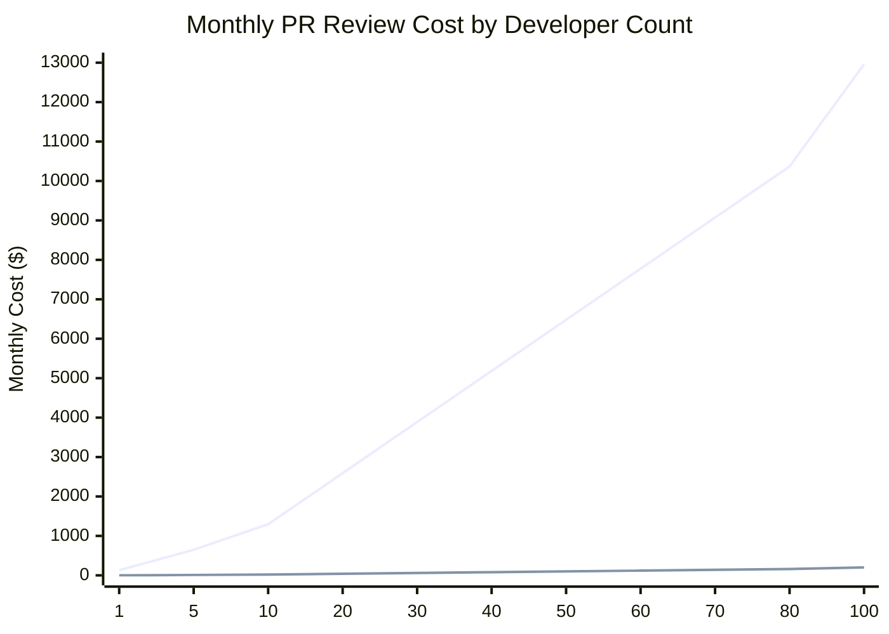

# co-maintainer

[](https://www.npmjs.com/package/co-maintainer) [](https://muratkirazkaya.com/blogs/co-maintainer-an-imitator-of-yours)

[Website](https://co-maintainer.com) ·
[Docs](https://co-maintainer.com/docs/getting-started.html) ·
[Cloud](https://cloud.co-maintainer.com) (hosted, free, early access, invite only for now)

An imitator of yours, A PR review tool like co-maintainer.

It collects current code and workflows, selected pull requests and diffs, and
default-branch commits. A low-cost model extracts evidence-bound observations. A
higher-reasoning model turns them into concise contribution guidance for
implementation, testing, review, and release decisions.

## Installation

```sh
npm install -g co-maintainer
```

Requires Node.js 24 or newer.

## Usage

```sh
co-maintainer probe owner/repo --auth=gh

co-maintainer init owner/repo --auth=gh --ai=openrouter \
  --low-model=openai/gpt-oss-120b \
  --high-model=openai/gpt-5.6-luna \
  --include-codebase --include-pull-requests \
  --include-pull-request-changes --include-commit-history \
  --include-how-repo-works

co-maintainer review owner/repo 123 --improve-matrix=2 --debug

co-maintainer review              # local branch (staged, unstaged, untracked)
co-maintainer review --json       # machine-readable stdout, logs on stderr
```

Settings live in `config.json`, so a flag you use every time can be saved once:

```sh
co-maintainer config set ai-key sk-or-...        # OpenRouter key
co-maintainer config set high-model openai/gpt-5.6-luna
co-maintainer config set low-model openai/gpt-oss-120b
co-maintainer config list                        # every key, its value and its source
```

Documentation: [Getting started](https://co-maintainer.com/docs/getting-started.html)
(install to first review) and the [full docs site](https://co-maintainer.com/docs),
sources in [`docs/md/`](docs/md/).

Use `co-maintainer help`, `co-maintainer -h`, or `co-maintainer --help` for the
full CLI help. Every guide the CLI writes is also readable from the dashboard,
and the dashboard keeps its guides separate from the CLI's. See
[dashboard.md](docs/md/dashboard.md).

## Compared to other tools

co-maintainer is a new tool, so it has not been compared with many others yet.
It was benchmarked against [OCR](https://open-codereview.ai/) on `core_v2`. The
datasets are small, so read the numbers as a signal, not a guarantee.

| Claim, as measured on `core_v2` | Result             |
| ------------------------------- | ------------------ |
| Result quality against OCR      | 2 to 3x better     |
| Speed against OCR               | 2 to 8x faster     |
| Tokens per review against OCR   | 70 to 200x fewer   |
| Cost per review against OCR     | 60 to 270x cheaper |



_Calculated from co-maintainer's `core_v2` benchmark, which reports co-maintainer as 65x cheaper per review than OCR ($0.025/review vs. $1.62/review). Assumes 80 PR reviews per developer per month (40 PRs merged, about 2 reviews each)._

## Benchmarks

`core_v3` fits co-maintainer's use case better than the OCR comparison, so it is
the more meaningful metric here. Unlike the OCR comparison (real human review
comments as gold, see `benchmark/swe-prbench`), `bench core v3` scores against
deliberately seeded, hand-verified defects in a dedicated target repo. Half of
the PRs are kept as defect-free controls, so precision is measurable too, not
just recall. Full breakdown, per-PR results, and methodology:
[`benchmark/core_v3/README.md`](benchmark/core_v3/README.md).

| metric        | value                         | context                            |
| ------------- | ----------------------------- | ---------------------------------- |
| PRs reviewed  | 30 (14 defective, 16 control) | one target repo                    |
| F1            | 0.500                         | against seeded defects only        |
| Precision     | 0.353                         | 1.00 false positive per control PR |
| Recall        | 0.857                         | 12 of 14 defects found             |
| Avg cost / PR | $0.0045                       | low and high model together        |
| Avg time / PR | 28.9s                         | sequential, no concurrency         |

## Development

From a checkout:

```sh
npm install
npm test                 # unit, script and benchmark tests
npm run check            # tsc --noEmit
npm run docs:build       # rebuild docs/ from docs/md/
npm run e2e              # end-to-end CLI loop
npm run review-local-e2e # fake-AI local review loop
npm run dashboard:smoke  # browser smoke test
```
