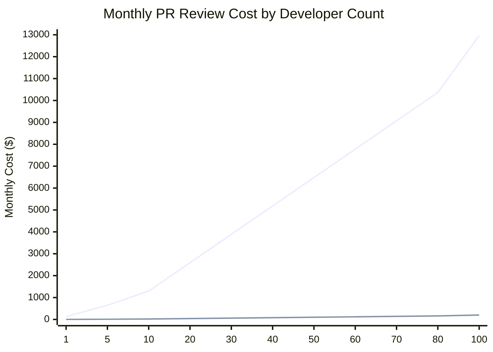

# co-maintainer

[](https://www.npmjs.com/package/co-maintainer)

`co-maintainer` analyzes a GitHub repository and writes repository-specific
`SKILL.md` guidance that helps developers contribute changes more reliably.

It collects current code and workflows, selected pull requests and diffs, and
default-branch commits. A low-cost model extracts evidence-bound observations; a
higher-reasoning model turns them into concise contribution guidance for
implementation, testing, review, and release decisions.

## Installation

```sh
npm install -g co-maintainer
```

Requires Node.js 24 or newer.

> **Migrating from JSR:** co-maintainer used to be published as
> `jsr:@murat/co-maintainer` for Deno. JSR is deprecated and no longer updated;
> install the npm package instead.

On a Linux VPS, persist npm's global bin directory if the installer prints a
PATH notice:

```sh
grep -qxF 'export PATH="$(npm prefix -g)/bin:$PATH"' ~/.bashrc || printf '\nexport PATH="$(npm prefix -g)/bin:$PATH"\n' >> ~/.bashrc
source ~/.bashrc
```

## Usage

```sh
co-maintainer probe owner/repo --auth=gh
```

```sh
co-maintainer probe owner/repo --auth=gh

co-maintainer init owner/repo --auth=gh --ai=openrouter --token=... \
  --low-model=openai/gpt-oss-120b \
  --high-model=openai/gpt-5.6-luna \
  --include-codebase --include-pull-requests \
  --include-pull-request-changes --include-commit-history \
  --include-how-repo-works

co-maintainer review owner/repo 123 --improve-matrix=2 --debug

co-maintainer review              # local branch (staged, unstaged, untracked)
co-maintainer review --json       # machine-readable stdout; logs on stderr

npm run review-local-e2e        # fake-AI local loop (developers, from repo root)
```

Documentation: [Getting started](docs/getting-started.html) (install → first
review), [full docs site](docs/index.html), sources in [`docs/md/`](docs/md/).

Use `co-maintainer help`, `co-maintainer -h`, or `co-maintainer --help` for the
full CLI help.

## Compared to other tools

co-maintainer is a newly tool so not compared a lot of other tools. But did
benchmarks with [OCR](https://open-codereview.ai/). Although I cannot offer any
guarantees because I am working with very small datasets, but it shows promise.

In core_v2 benchmarks:

- **2-3x better results** than OCR
- **2-8x faster** than OCR
- **70-200x fewer tokens** than OCR
- **60-270x cheaper** than



_Calculated based on co-maintainer's `core_v2` benchmark, which reports co-maintainer as 65x cheaper per review than OCR ($0.025/review vs. $1.62/review). Assumes 80 PR reviews per developer per month (40 PRs merged, avg. ~2 reviews each)._

## Benchmarks

We recommend consider core_v3 benchmark results because of more suits for
co-maintainer use cases. It is a much more meaningful metric than other
benchmarks. core_v3 is co-maintainer only benchmark.

Unlike the OCR comparison above (real human review comments as gold, see
`benchmark/swe-prbench`), `bench core v3` scores against deliberately seeded,
hand-verified defects in a dedicated target repo, half of the PRs kept as
defect-free controls so precision is measurable too, not just recall. Full
breakdown, per-PR results, and methodology:
[`benchmark/core_v3/README.md`](benchmark/core_v3/README.md).

| metric        | value                         |
| ------------- | ----------------------------- |
| PRs reviewed  | 30 (14 defective, 16 control) |
| F1            | 0.500                         |
| Precision     | 0.353                         |
| Recall        | 0.857                         |
| Avg cost / PR | $0.0045                       |
| Avg time / PR | 28.9s                         |
