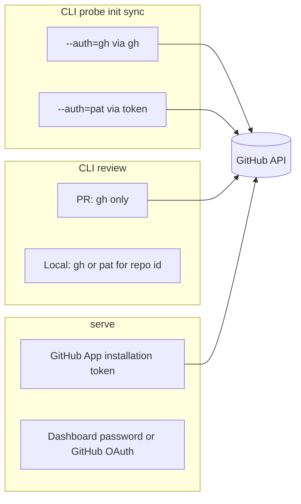

# Authentication

How co-maintainer **reads and writes GitHub** depends on which surface you use.
This page is about **CLI and server repo access**. Dashboard login and the
GitHub App are separate mechanisms.

## At a glance



| Surface | GitHub identity | Configure |
| ------- | ----------------- | --------- |
| `probe`, `init`, `sync` | `gh` or PAT | [Configuration](configuration.md), flags, `--env` |
| `review` (local / remote diff) | Same as above for mapping the clone to `owner/repo` | [Local review](local-review.md) |
| `review owner/repo N` (PR) | **`gh` only** | `gh auth login` |
| `serve` webhooks and PR posts | **GitHub App** | `set --github-app-id` + private key |
| Dashboard browser session | Password and/or GitHub OAuth user | [`serve`](serve.md#sign-in-to-the-dashboard) |

## CLI: `--auth=gh` (default)

```sh
co-maintainer set --auth=gh
co-maintainer probe owner/repo
```

- Uses the installed [GitHub CLI](https://cli.github.com/).
- You must run `gh auth login` yourself. co-maintainer only checks that `gh`
  can reach GitHub.
- Required for **PR review** (`co-maintainer review owner/repo 123`).

Check access: `gh auth status`.

Scopes `gh` needs:

<!-- permissions:gh:start -->
| Scope | Why |
| ----- | --- |
| `repo` | Read public and private repositories |
| `public_repo` | Read public repositories only |
<!-- permissions:gh:end -->

`gh auth login` grants `repo` by default. If a private repository answers with
a 403, run `gh auth refresh -s repo`.

## CLI: `--auth=pat`

```sh
co-maintainer init owner/repo --auth=pat --env=./.env
```

- Uses a personal access token from `--github-pat=...`, `GITHUB_TOKEN` /
  `GH_TOKEN`, or `set --github-pat=...`.
- Useful when `gh` is not installed or CI has no interactive `gh` login.
- Not used for PR review (that path always calls `gh`).
- Only reads. A token never posts reviews or creates check runs, the
  [GitHub App](github-app.md) does that.

### Fine-grained token (recommended)

1. On GitHub open **Settings**, **Developer settings**, **Personal access
   tokens**, **Fine-grained tokens**, then **Generate new token**.
2. Pick the **Resource owner** that owns the repositories. An organization may
   need to approve the token first.
3. Under **Repository access** choose **Only select repositories** and pick the
   ones you analyze.
4. Under **Repository permissions** set each permission below. GitHub labels the
   read level **Read-only**. It adds **Metadata** on its own.

<!-- permissions:pat-fine:start -->
| Repository permission | Access | Needed for |
| --------------------- | ------ | ---------- |
| Contents | Read | Read files and PR_REVIEW_GUIDE.md, read the file tree, read commit history, compare two commits, read releases in the probe |
| Issues | Read | Read the conversation on a pull request |
| Pull requests | Read | List pull requests, read a pull request, read the files a pull request changes, read earlier reviews, read review comment threads |
| Metadata | Read | Read the repository and its default branch, check the token can list repositories |
<!-- permissions:pat-fine:end -->

### Classic token

Open **Settings**, **Developer settings**, **Personal access tokens**,
**Tokens (classic)**, then **Generate new token (classic)** and tick one scope:

<!-- permissions:pat-classic:start -->
| Scope | Why |
| ----- | --- |
| `repo` | Read public and private repositories |
| `public_repo` | Read public repositories only |
<!-- permissions:pat-classic:end -->

Organizations that enforce SAML single sign-on also need the token authorized
for that organization on the token page.

## GitHub App (`serve`)

The App is **not** the same as CLI `gh` auth. Its permissions are listed on the
[GitHub App](github-app.md#permissions) page.

- Installed on orgs/repos for webhooks and posting PR reviews.
- Configured with `co-maintainer set --github-app-id=...` and a private key, or
  created for you from dashboard **Settings** with **Create GitHub App**
  ([`serve`: Create the App from the dashboard](serve.md#create-the-app-from-the-dashboard)).
- Optional `--github-webhook-secret=` verifies inbound webhooks.

See [Configuration](configuration.md#co-maintainer-set) and [`serve`](serve.md).

## Dashboard sign-in

Signing into the web UI does **not** replace CLI GitHub auth or the App.
It only gates access to the dashboard and Settings.

GitHub sign-in reuses the App's own OAuth credentials and asks GitHub for:

<!-- permissions:oauth:start -->
| Scope | Why |
| ----- | --- |
| None requested | The sign-in only reads your GitHub login from `GET /user` |
<!-- permissions:oauth:end -->

Setup: [`serve`: Sign in](serve.md#sign-in-to-the-dashboard).

## Troubleshooting

| Symptom | Likely fix |
| ------- | ---------- |
| `probe` / `init` cannot see a private repo | `gh auth login`, or a token with the permissions above and that repository selected |
| `GitHub refused ...` with a permission name | Grant that permission, the message names it |
| PR review says gh only | Run `gh auth login`, drop `--auth=pat` for that command |
| Webhook works but no review posted | Finish dashboard **Setup**, repo **init**, auto-review on |
| Settings save returns 422 | Token or App key missing GitHub scopes |

First-time CLI path: [Getting started](getting-started.md#2-save-defaults-once).
