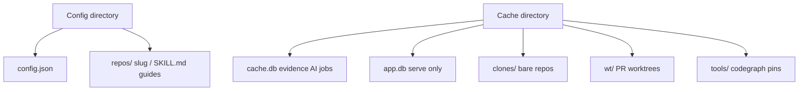

# Caching

co-maintainer keeps **config**, **generated guides**, **evidence caches**, and
(optional) **server state** on disk outside your git clones. Nothing in this
layout is meant to be edited by hand.

## On disk layout



### Config directory

| OS | Path |
| -- | ---- |
| Linux | `~/.config/co-maintainer/` |
| macOS | `~/Library/Application Support/co-maintainer/` |
| Windows | `%APPDATA%\co-maintainer\` |

| File / folder | Purpose |
| ------------- | ------- |
| `config.json` | Global `set` values and `repos["owner/repo"]` memory |
| `repos/<slug>/` | Generated guides for one GitHub repo (see below) |

Override: `CM_CONFIG_PATH` points at a different `config.json`.
Override guides root: `CM_REPOS_DIR` (must match on laptops and `serve` when
using server-side init).

### Cache directory

| OS | Path |
| -- | ---- |
| Linux | `~/.cache/co-maintainer/` |
| macOS | `~/Library/Caches/co-maintainer/` |
| Windows | `%LOCALAPPDATA%\co-maintainer\` |

| File / folder | Purpose |
| ------------- | ------- |
| `cache.db` | SQLite evidence and AI job cache for init/sync |
| `app.db` | SQLite state for [`serve`](serve.md) (repos, jobs, reviews) |
| `clones/` | Disposable bare clones for server jobs |
| `wt/` | Short-lived worktrees per PR on the server |
| `tools/` | Pinned helper binaries (for example codegraph), not on your PATH |

Override: `CM_APP_DB`, `CM_CLONES_DIR`, `CM_TOOLS_DIR` (see [Overrides](#overrides)).

### Tools directory

`tools/` holds helper binaries downloaded by co-maintainer, each pinned by
version so an upgrade never overwrites a working install:

```
tools/codegraph/1.6.0/node_modules/.bin/codegraph
```

Codegraph is the only tool for now. It is not on your `PATH`, and the CLI runs
the binary by absolute path. On the first local review that needs it,
co-maintainer asks before installing and names the version, source, approximate
size and this directory. Non-interactive runs (closed stdin, piped output, or
`CI`) skip the question and review without it. See
[Local review: Codegraph](local-review.md#codegraph).

## `cache.db` (CLI)

Used by [`init`](init.md) and [`sync`](sync.md):

| Kind of data | Cache key idea |
| ------------ | -------------- |
| Codebase files | Path + Git tree SHA |
| PR list | Per repo, refreshed when `updated_at` moves |
| PR discussions | PR number + update time |
| PR diffs | PR number + head SHA |
| AI synthesis jobs | Input hash + model profile |

[`sync`](sync.md) reuses unchanged rows so a moving default branch costs
less than a full [`init`](init.md). Delete `cache.db` only if you want a cold
rebuild (you still need repo config or flags for limits).

## `app.db` (`serve`)

Lives beside `cache.db` under the cache directory unless `CM_APP_DB` is set.
Holds dashboard data, job queue, webhook deduplication, remote review sessions,
and review history. **Forward-only migrations** when upgrading co-maintainer.

Back up `app.db` and `config.json` before major upgrades. See
[Dashboard: Updating](dashboard.md#updating).

## Generated guides

Under `repos/<slug>/` (slug is a stable hash of `owner/repo`, not the literal
name):

- `SKILL.md`, `CODEBASE.md`
- `PR_REVIEW_GUIDE.md` and related review guides when PR sources were included

Evidence for all repos shares one `cache.db` at the cache root (see above).

Paths are always under the config/cache roots so the CLI can run from any
working directory. [Configuration: Per-repo memory](configuration.md#per-repo-memory).

## Overrides

| Variable | Overrides |
| -------- | ----------- |
| `CM_CONFIG_PATH` | `config.json` file path |
| `CM_REPOS_DIR` | Directory containing per-repo guide folders |
| `CM_APP_DB` | `serve` database file |
| `CM_CLONES_DIR` | Server clone cache |
| `CM_TOOLS_DIR` | Downloaded tool binaries |

Use the same `CM_REPOS_DIR` on a `serve` host and on developer machines when
remote review should read guides the server built.

## When to refresh vs delete

| Goal | Action |
| ---- | ------ |
| Main moved, guides stale | [`sync`](sync.md) or dashboard **Sync** |
| Change include flags or limits | `sync`/`init` with new flags (updates config + guides) |
| Wipe server state | Stop `serve`, backup, remove `app.db` (destructive) |
| Go back after an upgrade | Stop `serve`, run [`rollback`](troubleshooting.md#going-back-after-an-upgrade) with the new version still installed |
| Wipe CLI evidence only | Remove `cache.db` (guides in `repos/` may remain) |
