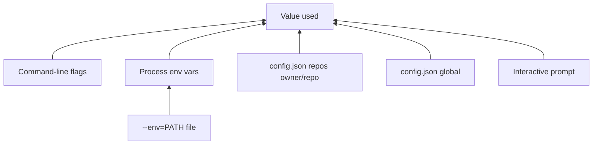

# Configuration

Global defaults live in `config.json` under the platform config directory.
[`co-maintainer set`](configuration.md#co-maintainer-set) writes that file. [`init`](init.md) /
[`sync`](sync.md) also record **per-repo** choices there (not API tokens).
Generated guides sit under `repos/` in the same tree. Full paths:
[Caching](caching.md#on-disk-layout).

[`serve`](serve.md) reads the same `config.json` for the GitHub App, webhook
URL, dashboard auth defaults, and CLI remote-review targets.

## Precedence

For CLI commands (`probe`, `init`, `sync`, `review`):



| Layer | Examples |
| ----- | -------- |
| Highest | `--token=`, `--auth=pat`, `--max-commits=500` on the command |
| Env file | Only when you pass `--env=./.env` (sets vars if not already set) |
| Environment | `GITHUB_TOKEN`, `OPENROUTER_API_KEY`, `CO_MAINTAINER_AUTH`, model env vars |
| Per-repo | `repos["owner/repo"]` after a successful init/sync |
| Global | `set` defaults in `config.json` |
| Lowest | Prompts when a required value is still missing |

API tokens are **never** stored per repo. They come from `--token=`, env, or
`set --token=...` only.

## `co-maintainer set`

Persists global settings so later commands can skip flags and prompts.

```sh
co-maintainer set --auth=gh --ai=openrouter --token=YOUR_KEY \
  --low-model=openai/gpt-oss-120b --high-model=openai/gpt-5.6-luna

co-maintainer set --github-app-id=... --github-app-private-key-file=./app.pem
co-maintainer set --github-app-id=... --github-app-private-key-path=./app.pem
co-maintainer set --remote-host=https://your-server --remote-token=cmr_...
```

### `set` flags

| Flag | Written to | Used by |
| ------ | ---------- | ------- |
| `--token=...` | `token` | CLI AI calls (OpenRouter) |
| `--ai-key=...` | `token` | An alias for `--token`, named for what it is |
| `--ai=none\|openrouter` | `ai` | CLI and dashboard jobs |
| `--low-model=...` / `--high-model=...` | `lowModel`, `highModel` | CLI and dashboard jobs |
| `--auth=gh\|pat` | `auth` | CLI GitHub reads |
| `--github-pat=...` | `githubPat` | CLI when `--auth=pat` |
| `--github-app-id=...` | `githubAppId` | `serve` |
| `--github-app-private-key=...` | `githubAppPrivateKey` | `serve` |
| `--github-app-private-key-file=path` | `githubAppPrivateKey` (contents) | `serve` |
| `--github-app-private-key-path=path` | `githubAppPrivateKeyPath` (path only) | `serve` |
| `--github-webhook-secret=...` | `githubWebhookSecret` | `serve` webhook HMAC |
| `--github-oauth-client-id=...` etc. | OAuth fields | Dashboard GitHub sign-in |
| `--password=...` | `dashboardPasswordHash` (stored as a hash) | Dashboard password sign-in |
| `--disable-auth=password` | `passwordAuthDisabled` | Default for `serve` |
| `--enable-auth=github` | `githubAuthEnabled` | Default for `serve` |
| `--remote-host=...` | `remoteHost` | `review --remote` |
| `--remote-token=...` | `remoteToken` | `review --remote` |
| `--review-blocking=model\|severity` | `reviewBlocking` | Whether a review's own severity decides a blocking finding |

### App private key: inline, file contents, or path

Three flags set the GitHub App private key, and they differ in what lands in
`config.json`:

- `--github-app-private-key=PEM` writes the key itself.
- `--github-app-private-key-file=path` reads the file and writes its
  **contents**. If the file later moves or is deleted, the App keeps working.
- `--github-app-private-key-path=path` writes only the **path**. The key stays
  on disk and is read at startup, so the secret never enters `config.json`. If
  the file is missing or unreadable, `serve` warns at startup that the App will
  not work.

An inline key wins if both an inline key and a path are ever present. `set`
clears the other form when you pass one, so the choice is unambiguous.

### Verification before saving

When the provider is OpenRouter, `set` checks the key against
`/api/v1/key` and, if a model is given, that `/api/v1/models` lists it. A bad
key or unknown model is refused with exit code 2 and **nothing is written**. A
network failure only warns (`saved anyway`), because that is not a typo. Pass
`--no-verify` to skip the check, for example in CI with an offline key.

OAuth setup steps: [`serve`: Sign in](serve.md#sign-in-to-the-dashboard).

## `co-maintainer config`

Reads and edits the same `config.json` without opening the file. `set` is the
short form of `config set`, and its output and flags are unchanged.

```sh
co-maintainer config list                  # key, value, and source per row
co-maintainer config get high-model        # one raw value, no label
co-maintainer config set remote-host https://review.example.com
co-maintainer config set --remote-token=cmr_...
co-maintainer config unset remote-token
co-maintainer config path                  # the config file
co-maintainer config path --all            # config, repos, and cache directories
```

`list` prints where each value came from: `env` (an environment variable
overrides the file at run time), `file`, or nothing for an unset key. Secrets
are masked: twelve characters or more keep their last four, shorter ones show
only `••••`, and the dashboard password reports `set` or `not set` rather than
its hash. `get` prints the real value, so treat its output as a secret.

Keys are the `UserConfig` field names in kebab-case (`high-model`,
`remote-host`, `review-blocking`), and camelCase is accepted too. A name that is
not a config key is refused with exit code 2.

### Config keys

Every key `config.json` can hold. The mask column says whether `config list`
hides the value.

| Key | Type | Source | Masked |
| --- | ---- | ------ | ------ |
| `auth` | `gh` or `pat` | `set` flag | no |
| `ai` | `none` or `openrouter` | `set` flag | no |
| `low-model` | string | `set` flag | no |
| `high-model` | string | `set` flag | no |
| `token` | string | `--token` or `--ai-key` | yes |
| `github-pat` | string | `--github-pat` | yes |
| `github-app-id` | string | `--github-app-id` | no |
| `github-app-private-key` | PEM string | `--github-app-private-key`, `--github-app-private-key-file` | yes |
| `github-app-private-key-path` | path string | `--github-app-private-key-path` | yes |
| `github-webhook-secret` | string | `--github-webhook-secret` | yes |
| `webhook-url` | URL string | Settings, Server | no |
| `github-oauth-client-id` | string | `--github-oauth-client-id` | no |
| `github-oauth-client-secret` | string | `--github-oauth-client-secret` | yes |
| `github-oauth-allowed-user` | string | `--github-oauth-allowed-user` | no |
| `password-auth-disabled` | boolean | `--disable-auth=password`, `--enable-auth=password` | no |
| `github-auth-enabled` | boolean | `--enable-auth=github`, `--disable-auth=github` | no |
| `dashboard-password-hash` | scrypt hash | `--password` | reported as `set` or `not set` |
| `defaults` | object | `init` / `sync` limits | no |
| `max-concurrent-jobs` | number | Settings, or the field directly | no |
| `review-blocking` | `model` or `severity` | `--review-blocking` | no |
| `remote-host` | URL string | `--remote-host` | no |
| `remote-token` | string | `--remote-token` | yes |
| `repos` | object | Written by `init` and `sync` | no |

`config get` prints the real value even for a masked key, so treat its output as
a secret.

### Unset

```sh
co-maintainer set --unset=token
co-maintainer set --unset=github-webhook-secret
co-maintainer set --unset=disable-auth
```

`--unset=disable-auth` clears `passwordAuthDisabled` so the dashboard password
is allowed again. Match `--unset=` to the field name or the flag name (see
`co-maintainer set --help`).

## Per-repo memory

After each successful [`init`](init.md) or [`sync`](sync.md),
`config.json` gains `repos["owner/repo"]` with:

| Stored | Not stored |
| ------ | ---------- |
| `auth`, `ai`, models | API token |
| `max-*` limits | GitHub PAT (global only) |
| `include-*` flags | |
| `only-request-changed-pr`, `pr-state` | |

A plain `co-maintainer sync owner/repo` reuses those values. Pass new flags
on `sync` or run `init` again to change includes, limits, or pull request
filters permanently. `--only-request-changed-pr` stays on once saved. To
collect every pull request state again, pass `--pr-state=open,closed,merged`.

Guide files (`SKILL.md`, `CODEBASE.md`, review guides) live under
`<config>/co-maintainer/repos/<slug>/`, not in your git clone. See
[Caching](caching.md#generated-guides). `co-maintainer view` prints them
locally, and `view --remote` prints the copies a configured review server holds
(see [Remote review](remote-review.md#reading-the-servers-guides)).

## Secrets on disk

`config.json` may contain tokens, PATs, App private keys, and webhook/OAuth
secrets in **plain text**. The file is chmod `0600` where supported (not on
Windows).

| Situation | Suggestion |
| --------- | ---------- |
| Personal laptop | `set` is fine |
| Shared CI | Prefer `--env=PATH` or flags, avoid committing config |
| `serve` host | Lock down the config directory like any secret store |

Dashboard **Settings** can also save credentials after validating them with
GitHub.

## Path overrides

| Variable | Effect |
| -------- | ------ |
| `CM_CONFIG_PATH` | Replace `config.json` location (tests) |
| `CM_REPOS_DIR` | Replace generated guides root (must match `serve` for server init) |

More cache and database paths: [Caching](caching.md#overrides).
