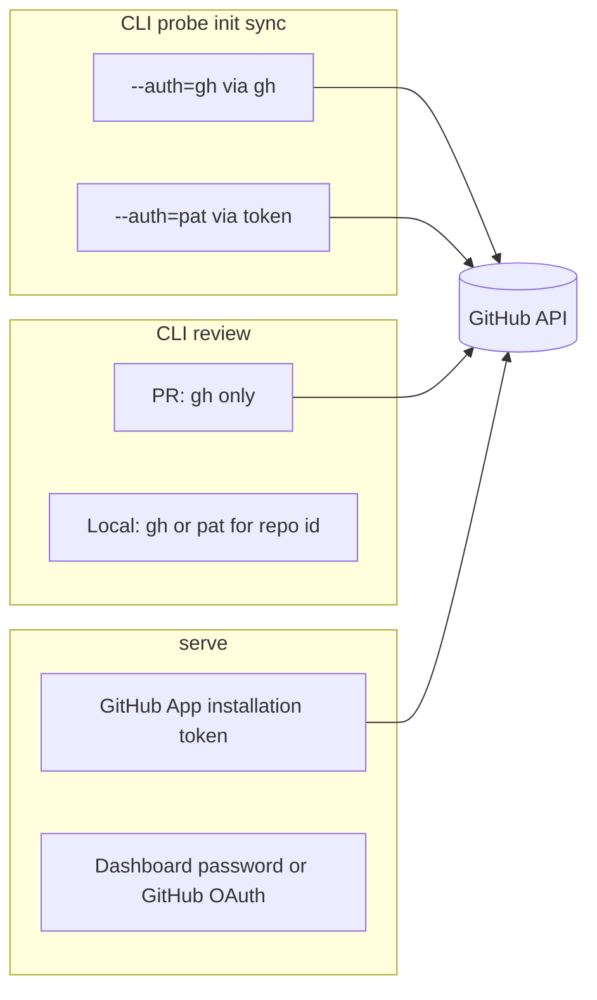

# Authentication

How co-maintainer **reads and writes GitHub** depends on which surface you use.
This page is about **CLI and server repo access**. Dashboard login and the
GitHub App are separate mechanisms.

## At a glance



| Surface | GitHub identity | Configure |
| ------- | ----------------- | --------- |
| `probe`, `init`, `sync` | `gh` or PAT | [Configuration](configuration.md), flags, `--env` |
| `review` (local / remote diff) | Same as above for mapping the clone to `owner/repo` | [Local review](local-review.md) |
| `review owner/repo N` (PR) | **`gh` only** | `gh auth login` |
| `serve` webhooks and PR posts | **GitHub App** | `set --github-app-id` + private key |
| Dashboard browser session | Password and/or GitHub OAuth user | [`serve`](serve.md#sign-in-to-the-dashboard) |

## CLI: `--auth=gh` (default)

```sh
co-maintainer set --auth=gh
co-maintainer probe owner/repo
```

- Uses the installed [GitHub CLI](https://cli.github.com/).
- You must run `gh auth login` yourself. co-maintainer only checks that `gh`
  can reach GitHub.
- Required for **PR review** (`co-maintainer review owner/repo 123`).

Check access: `gh auth status`.

## CLI: `--auth=pat`

```sh
co-maintainer init owner/repo --auth=pat --env=./.env
```

- Uses a personal access token from `--github-pat=...`, `GITHUB_TOKEN` /
  `GH_TOKEN`, or `set --github-pat=...`.
- Useful when `gh` is not installed or CI has no interactive `gh` login.
- Not used for PR review (that path always calls `gh`).

Token needs read access to the repositories you analyze. Private repos need
scopes your org allows.

## GitHub App (`serve`)

The App is **not** the same as CLI `gh` auth:

- Installed on orgs/repos for webhooks and posting PR reviews.
- Configured with `co-maintainer set --github-app-id=...` and a private key.
- Optional `--github-webhook-secret=` verifies inbound webhooks.

See [Configuration](configuration.md#set) and [`serve`](serve.md).

## Dashboard sign-in

Signing into the web UI does **not** replace CLI GitHub auth or the App.
It only gates access to the dashboard and Settings.

Setup: [`serve`: Sign in](serve.md#sign-in-to-the-dashboard).

## Troubleshooting

| Symptom | Likely fix |
| ------- | ---------- |
| `probe` / `init` cannot see a private repo | `gh auth login` or PAT with repo scope |
| PR review says gh only | Run `gh auth login`, drop `--auth=pat` for that command |
| Webhook works but no review posted | Finish dashboard **Setup**, repo **init**, auto-review on |
| Settings save returns 422 | Token or App key missing GitHub scopes |

First-time CLI path: [Getting started](getting-started.md#2-save-defaults).
