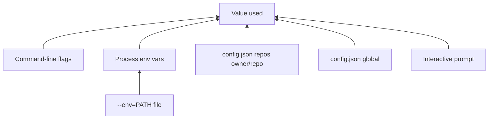

# Configuration

Global defaults live in `config.json` under the platform config directory.
[`co-maintainer set`](configuration.md#set) writes that file. [`init`](init.md) /
[`remake`](remake.md) also record **per-repo** choices there (not API tokens).
Generated guides sit under `repos/` in the same tree. Full paths:
[Caching](caching.md#on-disk-layout).

[`serve`](serve.md) reads the same `config.json` for the GitHub App, webhook
URL, dashboard auth defaults, and CLI remote-review targets.

## Precedence

For CLI commands (`probe`, `init`, `remake`, `review`):



| Layer | Examples |
| ----- | -------- |
| Highest | `--token=`, `--auth=pat`, `--max-commits=500` on the command |
| Env file | Only when you pass `--env=./.env` (sets vars if not already set) |
| Environment | `GITHUB_TOKEN`, `OPENROUTER_API_KEY`, `CO_MAINTAINER_AUTH`, model env vars |
| Per-repo | `repos["owner/repo"]` after a successful init/remake |
| Global | `set` defaults in `config.json` |
| Lowest | Prompts when a required value is still missing |

API tokens are **never** stored per repo. They come from `--token=`, env, or
`set --token=...` only.

## `co-maintainer set`

Persists global settings so later commands can skip flags and prompts.

```sh
co-maintainer set --auth=gh --ai=openrouter --token=YOUR_KEY \
  --low-model=openai/gpt-oss-120b --high-model=openai/gpt-5.6-luna

co-maintainer set --github-app-id=... --github-app-private-key-file=./app.pem
co-maintainer set --remote-host=https://your-server --remote-token=cmr_...
```

### `set` flags

| Flag | Written to | Used by |
| ------ | ---------- | ------- |
| `--token=...` | `token` | CLI AI calls (OpenRouter/Hetzner) |
| `--ai=none\|openrouter\|hetzner` | `ai` | CLI and dashboard jobs |
| `--low-model=...` / `--high-model=...` | `lowModel`, `highModel` | CLI and dashboard jobs |
| `--auth=gh\|pat` | `auth` | CLI GitHub reads |
| `--github-pat=...` | `githubPat` | CLI when `--auth=pat` |
| `--github-app-id=...` | `githubAppId` | `serve` |
| `--github-app-private-key=...` | `githubAppPrivateKey` | `serve` |
| `--github-app-private-key-file=path` | same as inline key | `serve` |
| `--github-webhook-secret=...` | `githubWebhookSecret` | `serve` webhook HMAC |
| `--github-oauth-client-id=...` etc. | OAuth fields | Dashboard GitHub sign-in |
| `--disable-auth=password` | `passwordAuthDisabled` | Default for `serve` |
| `--enable-auth=github` | `githubAuthEnabled` | Default for `serve` |
| `--remote-host=...` | `remoteHost` | `review --remote` |
| `--remote-token=...` | `remoteToken` | `review --remote` |

OAuth setup steps: [`serve`: Sign in](serve.md#sign-in-to-the-dashboard).

### Unset

```sh
co-maintainer set --unset=token
co-maintainer set --unset=github-webhook-secret
co-maintainer set --unset=disable-auth
```

`--unset=disable-auth` clears `passwordAuthDisabled` so the dashboard password
is allowed again. Match `--unset=` to the field name or the flag name (see
`co-maintainer set --help`).

## Per-repo memory

After each successful [`init`](init.md) or [`remake`](remake.md),
`config.json` gains `repos["owner/repo"]` with:

| Stored | Not stored |
| ------ | ---------- |
| `auth`, `ai`, models | API token |
| `max-*` limits | GitHub PAT (global only) |
| `include-*` flags | |

A plain `co-maintainer remake owner/repo` reuses those values. Pass new flags
on `remake` or run `init` again to change includes or limits permanently.

Guide files (`SKILL.md`, `CODEBASE.md`, review guides) live under
`<config>/co-maintainer/repos/<slug>/`, not in your git clone. See
[Caching](caching.md#generated-guides).

## Secrets on disk

`config.json` may contain tokens, PATs, App private keys, and webhook/OAuth
secrets in **plain text**. The file is chmod `0600` where supported (not on
Windows).

| Situation | Suggestion |
| --------- | ---------- |
| Personal laptop | `set` is fine |
| Shared CI | Prefer `--env=PATH` or flags, avoid committing config |
| `serve` host | Lock down the config directory like any secret store |

Dashboard **Settings** can also save credentials after validating them with
GitHub.

## Path overrides

| Variable | Effect |
| -------- | ------ |
| `CM_CONFIG_PATH` | Replace `config.json` location (tests) |
| `CM_REPOS_DIR` | Replace generated guides root (must match `serve` for server init) |

More cache and database paths: [Caching](caching.md#overrides).
