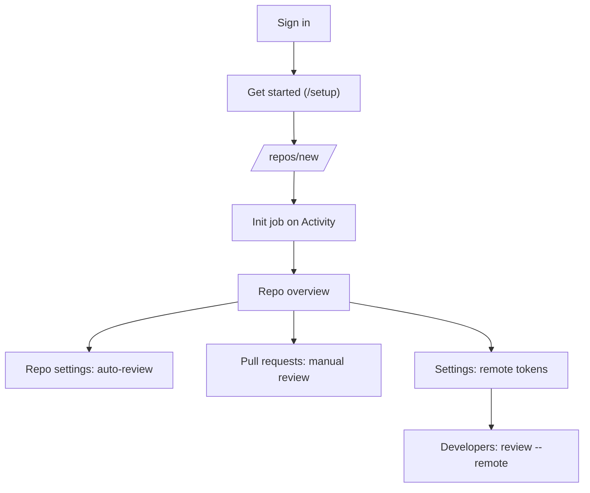

# Dashboard

Web UI started by [`serve`](serve.md). Use it to finish setup, add repositories,
run [`init`](init.md) / [`remake`](remake.md), tune auto-review, watch jobs, and
manage [remote review](remote-review.md) tokens. Webhooks and the job worker run
in the same process as the UI.

## What it is for

| Goal | Where to go |
| ---- | ----------- |
| First-time server setup | **Get started** on home or `/setup`, then **Settings** |
| Onboard a repo | **Add repository**, wait on **Activity** |
| Refresh guides after `main` moves | Repo **Overview** or **Settings** (Remake) |
| Team laptops without local init | **Settings** remote tokens, repo **Remote** tab |
| Debug a failed job | **Activity** job detail |

## Before you open

| Check | Why |
| ----- | --- |
| [`serve`](serve.md) is running | Dashboard is not a separate install |
| Dashboard URL from startup log | Default `http://localhost:<port>/` |
| Password or GitHub sign-in | See [Sign in](#sign-in) and [`serve`: Sign in](serve.md#sign-in-to-the-dashboard) |
| Browser on a host that can reach the server | Same network or VPN as production |

`/dashboard` redirects to `/`.

## Sign in

Open `http://<host>:<port>/`.

- **Password**: printed at `serve` startup, or set with `--password=...`.
- **GitHub** (optional): **Continue with GitHub** for the one allowed user.
  OAuth setup lives on [`serve`](serve.md#sign-in-to-the-dashboard).

Sessions use an `HttpOnly`, `SameSite=Lax` cookie (`Secure` on HTTPS).

## Get started (`/setup`)

Onboarding checklist: models and API key, GitHub access, GitHub App. Each step
links to **Settings** to fix gaps.

This page is **not** in the top bar. After sign-in, open
`http://<host>:<port>/setup` or click **Get started** on the home page when you
have no repositories yet. You can skip it and configure the same items under
**Settings** at any time.

## Routes

Top bar: **Activity**, **Usage** (`/analytics`), **Settings**, signed-in user.

| Path | Purpose |
| ---- | ------- |
| `/` | Repository list, **Get started** (when empty), **Add repository**, auto-review toggles |
| `/setup` | Same checklist as above (direct URL) |
| `/repos/new` | Pick an App-installed repo and start **init** |
| `/repos/:owner/:repo` | Overview, 30-day stats, drift **Update now**, recent PRs |
| `/repos/:owner/:repo/pulls` | PR list by number, manual **Review** when webhooks fail |
| `/repos/:owner/:repo/pulls/:n` | Findings and cost for one PR |
| `/repos/:owner/:repo/remote` | Remote CLI reviews for this repo (last 30 days) |
| `/repos/:owner/:repo/knowledge` | Generated guides, **Remake** |
| `/repos/:owner/:repo/settings` | Auto-review, skip rules, scope, remove repo |
| `/activity` | Live and recent jobs (refreshes about every 5 seconds) |
| `/activity/:id` | Single job log |
| `/analytics` | Usage for 7, 30, or 90 days |
| `/settings` | Global models, GitHub, App, webhook URL, remote limits and tokens |

Per-repo sidebar: **Overview**, **Pull requests**, **Remote**, **Knowledge**, **Settings**.

PR titles are not stored in `app.db`, so lists show `#number` only.

## Settings (global)

Single page with sections (anchor links in the sidebar):

| Section | What you configure |
| ------- | ------------------ |
| Models and API key | Provider, token, low/high models for server jobs |
| GitHub | `gh` or PAT for init/remake and server-side Git reads |
| Defaults | Auth and include/limit defaults for new work |
| Server | Webhook URL shown to GitHub, queue and timeout knobs |
| Remote review | `cmr_…` tokens, per-token concurrency, sync timeout |
| Access | Password vs GitHub sign-in toggles (mirrors `serve` flags) |
| About | Version and source link |

Saving PAT, App key, or OAuth values is validated against GitHub first. Bad
scopes return **422** and nothing is stored.

## UI behavior

- Failed API calls show a toast and **Retry**.
- Toggles roll back if save fails.
- [`serve --inject-500`](serve.md#parameters) (or `CM_INJECT_500=1`) forces mutating
  `/api/*` calls except login to fail, for testing error UI.

## Linux

Linux (WSL included) is the recommended platform for [`serve`](serve.md) and the
dashboard:

- SQLite FFI, advisory locks, and POSIX signals behave more predictably.
- Windows is supported but treated as unstable.
- `serve` logs a one-line warning when not on Linux.

## Updating

Forward-only `app.db` migrations. Do not downgrade the CLI after a newer version
has run.

1. Stop `serve`.
2. `deno install -f -g jsr:@murat/co-maintainer`
3. Start `serve` again with the same data directory.

Restart after upgrading. Details also on [`serve`: Updating](serve.md#updating).
