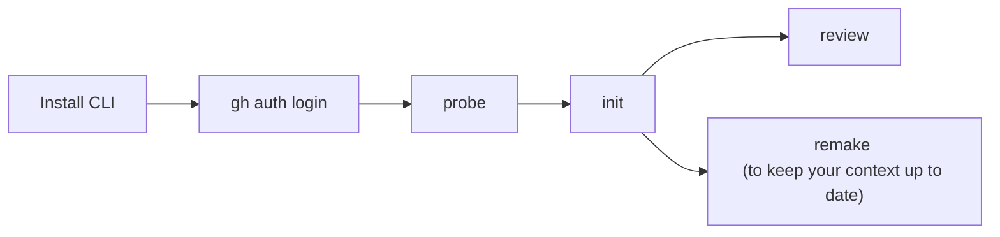
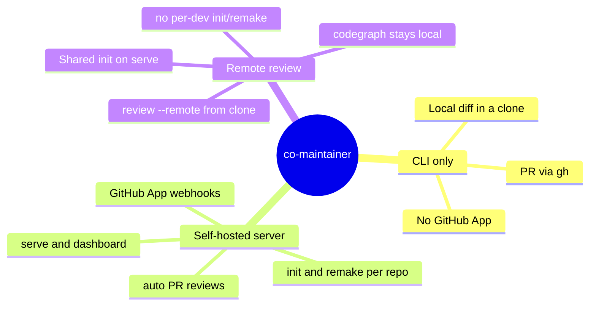
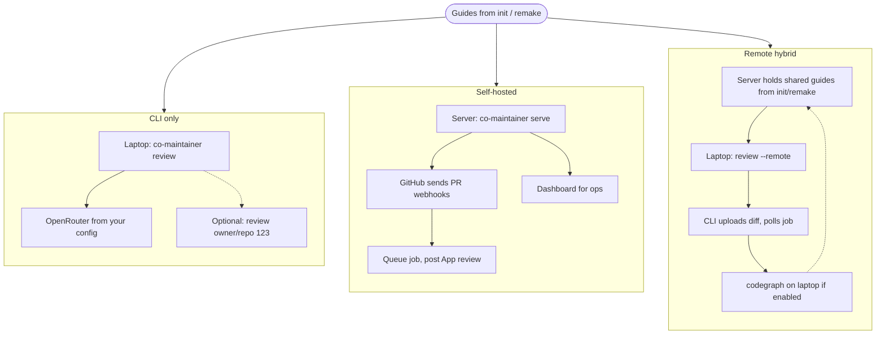

# Getting started

co-maintainer learns a GitHub repo, writes review guides on your machine, then
reviews a PR or local diff. Start with the CLI. [`serve`](serve.md) and
[`remote-review`](remote-review.md) are optional later.

## Overview



**Need:** [Node.js 24+](https://nodejs.org/), a repo you can read, `gh auth login`, an
[OpenRouter](https://openrouter.ai/) key. Details: [Authentication](authentication.md).

## 1. Install

```sh
npm install -g co-maintainer
co-maintainer help
co-maintainer --version
```

PATH issues or general install notes: [README install](https://github.com/GroophyLifefor/co-maintainer#installation).

## 2. Save defaults (once)

```sh
co-maintainer set --auth=gh --ai=openrouter --token=YOUR_OPENROUTER_KEY --low-model=openai/gpt-oss-120b --high-model=openai/gpt-5.6-luna
```

[Configuration](configuration.md)

## 3. One repo

```sh
co-maintainer probe owner/repo 
co-maintainer init owner/repo ...args 
```

[`init`](init.md) takes time and API cost. Prefer the [`init`](init.md) line from [`probe`](probe.md) output.

## 4. Review

```sh
co-maintainer review   # local changes
co-maintainer review owner/repo 123   # pull request
```

[Local review](local-review.md) · [PR review](local-pr-review.md)

## Ways to use it (after `init`)

Same repo guides can power three different setups. You can mix them over time
(for example CLI on your laptop plus `serve` for the team).



### How each path runs



| You want | Where it runs | Typical entry | Read |
| -------- | ------------- | ------------- | ---- |
| Try a PR or local branch quickly | Your machine | `review` or `review owner/repo 123` | [local-review](local-review.md) · [PR review](local-pr-review.md) |
| Team-wide PR reviews without everyone running the CLI | Your server + GitHub App | `set` App credentials, then `serve` | [serve](serve.md) |
| Operate repos, tokens, concurrency | Browser on the server | Dashboard after `serve` | [dashboard](dashboard.md) |
| Review a local diff without every developer running init/remake | Laptop + server | `set --remote-host` then `review --remote` | [remote-review](remote-review.md) |
| Refresh guides after main moves | Same place as `init` | `remake owner/repo` | [remake](remake.md) |

Guides and cache paths: [Caching](caching.md). Flags and `co-maintainer set`:
[Configuration](configuration.md).

## If something breaks

Run `probe` only after install. Run `init` before `review`. co-maintainer does
not run `gh auth login` for you. Use `--debug` on failures.
