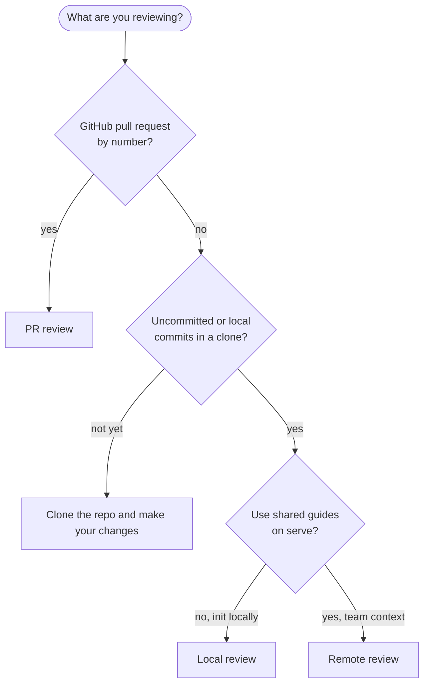
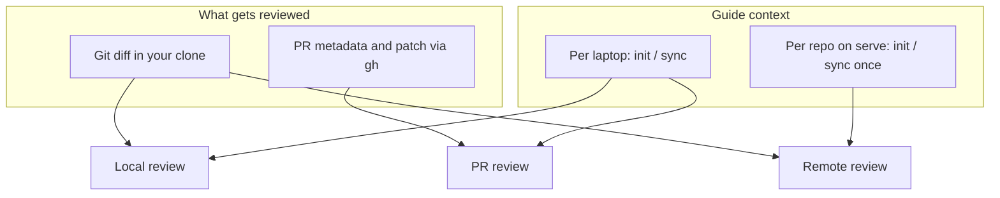

# Review

AI code review using guides from [`init`](init.md) / [`sync`](sync.md).
Progress and diagnostics go to **stderr**. The result goes to **stdout** (human
text or JSON with `--json`).

This page helps you **pick a mode**. Commands, flags, and checklists live on the
linked pages below.

## Which mode should I use?

Start with what you are trying to review, not the flag name.



| If this sounds like you | Mode | Read next |
| ----------------------- | ---- | --------- |
| You are in a clone and want feedback on your branch or working tree before you open a PR | [Local review](local-review.md) | OpenRouter on your machine, guides on disk |
| Same as local review, but the repo is already inited on [`serve`](serve.md) and you skip per-laptop init/sync | [Remote review](remote-review.md) | Shared context on the server, diff from your clone |
| You have a PR number and do not need to check out that branch locally | [PR review](local-pr-review.md) | `gh` only, guides on disk, AI on your machine |

PR review and remote review **do not combine**: `--remote` is only for a local
diff with no PR positional arguments.

## How the three modes differ

Same underlying guides from `init` / `sync`, different **subject** (what gets
reviewed) and **who keeps that context up to date**.



| | Local review | PR review | Remote review |
| --- | --- | --- | --- |
| Typical moment | Pre-push in your clone, you own local guides | Open PR by number, you own local guides | Pre-push using the team's shared server context |
| Who runs init/sync | You on the laptop | You on the laptop | Ops on the server (you usually do not) |
| Guides at review time | Laptop cache | Laptop cache | Server dashboard repo |
| Extra setup | OpenRouter | `gh auth login` | `serve`, token, `set --remote-host` |
| Deep dive | [local-review](local-review.md) | [local-pr-review](local-pr-review.md) | [remote-review](remote-review.md) |

Team-wide **automatic** PR reviews on webhooks are not a fourth `review` mode.
They go through [`serve`](serve.md) and the GitHub App. Use PR review when **you**
run the CLI against one PR.

## Exit codes

| Code | Meaning |
| ------ | ----- |
| 0 | Review finished, no open blocking findings |
| 1 | Review finished, at least one blocking finding |
| 2 | Usage or precondition error (init missing, not a git repo, etc.) |
| 3 | Runtime failure or abort |

### What counts as blocking

`reviewBlocking` in `config.json` decides it, and the same rule is used by
local, PR, remote and the automatic GitHub App reviews.

| Value | A finding blocks when |
| ----- | ----- |
| `model` (default) | The model says so. A P0 always blocks, even if the model labeled it otherwise. |
| `severity` | Its severity is P0 or P1. P2 and P3 never block, whatever the model said. |

The default keeps the 0.4.13 behavior. `severity` exists because the model's
own label can move between two reviews of the same code, which flipped the exit
code for the same finding; with `severity` the same finding set always yields
the same exit code, the same `blocking` count in `--json`, and the same GitHub
review type.

```sh
co-maintainer config set --review-blocking=severity
co-maintainer config set --review-blocking=model      # back to the default
```

`CO_MAINTAINER_REVIEW_BLOCKING` overrides it for one environment.

## JSON output

With `--json`, stdout is a single JSON object (`schemaVersion` `1`). Fields
include `mode` (`local`, `remote`, or `pr`), `subject`, `summary`, `findings[]`,
`warnings[]`, `usage`, and `durationMs`. Local and remote runs also include diff
metadata and `codegraph` state. Errors with `--json` are JSON on stdout as well.

Flag details per mode: [Local review](local-review.md), [Remote review](remote-review.md),
[PR review](local-pr-review.md).

## How findings are produced

The model is asked for a JSON object, not for prose. For each finding it returns
the severity, whether it blocks, the path and line span, the symbol, a title, the
explanation, and an optional replacement. `co-maintainer` renders the Markdown
from that object, so a finding's boundaries are never guessed from the model's
wording. The JSON schema is sent as OpenRouter's `response_format` when the
provider accepts it; a provider that rejects the combination gets one request
without the schema, and the prompt also asks for a fenced JSON block.

If the answer is not usable JSON, the request is retried once and then, if it
still fails, the older Markdown parser reads it. That parser accepts `—` or `:`
as the heading separator, so answers written before this change (and carry-over
records saved by `0.4.13`) keep working. The `--json` output and the human output
are both built from the same parsed findings, so they can never disagree.

## Before any review

| Check | Why |
| ----- | --- |
| [`init`](init.md) or [`sync`](sync.md) on your laptop | Required for local and PR review |
| [OpenRouter](configuration.md) for local and PR review | AI runs on your machine |
| [Remote setup](remote-review.md) for `--remote` | Host, token, repo already inited on the server |
