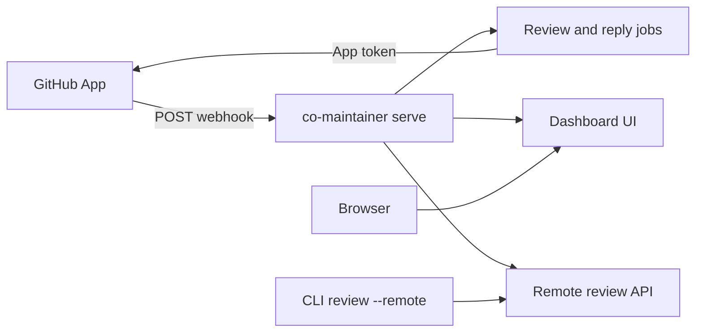

# `serve`

Long-running process for **self-hosted** co-maintainer: GitHub App webhooks,
background review jobs, the [dashboard](dashboard.md), and the API used by
[remote review](remote-review.md). One binary, one `app.db`, one config dir.

Linux (WSL included) is the recommended platform. See
[dashboard: Linux](dashboard.md#linux) for why.

## What it does



| Piece | Role |
| ----- | ---- |
| `POST /github/webhook` | PR and conversation events enqueue work |
| Dashboard at `/` | Per-repo init/sync, settings, activity, credentials |
| Job worker | Auto PR reviews, setup jobs, conversation replies |
| Remote review | Shared repo context for laptops without local init |

Team flow: configure the App once, run `serve`, add repos on the dashboard,
then either webhooks review PRs or developers use [`review --remote`](remote-review.md).
CLI-only users can ignore `serve` until they need shared context or automation.

## Before you run

| Check | Why |
| ----- | --- |
| [Install](getting-started.md#1-install) `co-maintainer` | `serve` is a CLI command |
| GitHub App (optional at startup) | Add it later in the dashboard **Settings**, or with `co-maintainer set` ([Configuration](configuration.md)). Changes apply without a restart. The dashboard can also create it for you (see [Create the App from the dashboard](#create-the-app-from-the-dashboard)) |
| `--github-webhook-secret=` (recommended) | Verifies webhook payloads |
| AI and GitHub access via dashboard **Get started** (`/setup`) or **Settings** | Reviews need models and repo access (can finish after first boot) |
| Public URL for webhooks (production) | GitHub must reach `POST .../github/webhook` |
| Linux or WSL for production | Other platforms log a warning and continue |

## Usage

```sh
co-maintainer set --github-app-id=... --github-app-private-key-file=./app.pem
co-maintainer set --github-webhook-secret=...
co-maintainer serve --port=5000

co-maintainer serve --port=5000 --password=your-dashboard-secret
co-maintainer serve --port=5000 --webhook-url=https://example.com/github/webhook
```

At startup, `serve` prints `app.db` path, dashboard URL, and webhook URL. On the
first start with password auth on it also generates a dashboard password and
prints it once. The password is stored in `config.json` as a hash, so later
starts keep it.

## Parameters

| Flag | Meaning |
| ------ | ----- |
| `--port=N` | HTTP port (required, 1 to 65535) |
| `--password=...` | Replace the stored dashboard password (a random one is generated on the first start if none exists) |
| `--webhook-url=...` | Public webhook URL GitHub should use (also `CM_WEBHOOK_URL` or saved in Settings) |
| `--disable-auth=password` | Turn off password sign-in for this run |
| `--enable-auth=github` | Turn on GitHub OAuth sign-in for this run |
| `--trust-proxy` | Trust `x-forwarded-for` and `x-forwarded-proto` from a reverse proxy in front (also `CM_TRUST_PROXY=1`, see [Behind a reverse proxy](#behind-a-reverse-proxy)) |
| `--inject-500` | Every mutating `/api/*` call returns 500 (failure UI testing, also `CM_INJECT_500=1`) |
| `CM_LOGIN_HINT` | Text shown on the sign-in page instead of the default "printed when `serve` started" line. Useful when a deployment hands out its own password, as the Cloud image does. Escaped as plain text |

Per-run `--disable-auth` / `--enable-auth` override values from `co-maintainer
set`. At least one sign-in method must stay enabled.

Persistent App, webhook, OAuth, and webhook URL fields: [Configuration](configuration.md)
and dashboard **Settings**.

## Sign in to the dashboard

**Password (default).** Copy the password from the `serve` console on first start,
or set it with `--password=...` or `co-maintainer set --password=...`. Change it
any time from **Settings**, which also signs out the other browser sessions.

**GitHub sign-in (optional).** One allowed GitHub user can sign in with the App's
OAuth client (no separate OAuth App).

1. On the GitHub App settings page, set **Redirect URL** to
   `http://<host>:<port>/auth/github/callback` (same host and port as `serve`).
2. Copy client ID and client secret from that page.
3. Save credentials and the allowed username:
   ```sh
   co-maintainer set --github-oauth-client-id=... \
     --github-oauth-client-secret=... \
     --github-oauth-allowed-user=your-github-username
   ```
4. Enable on the command line when needed:
   ```sh
   co-maintainer serve --port=5000 --enable-auth=github
   co-maintainer serve --port=5000 --disable-auth=password --enable-auth=github
   ```

OAuth and auth toggles can also be changed later in dashboard **Settings**. UI
routes and failure behavior: [Dashboard](dashboard.md).

The sign-in page says "Use the dashboard password printed when serve started."
Set `CM_LOGIN_HINT` to replace that line with your own text, for example a
pointer to the password your deployment already gave the user. It is shown as
plain text and escaped, so it cannot inject markup.

## Create the App from the dashboard

Creating an App by hand means copying a private key, a webhook secret, and OAuth
credentials between GitHub and the dashboard, and the webhook secret is easy to
mismatch. The GitHub App card in **Settings** can create the App for you instead:

1. Set a public **Webhook address** first. On `http://localhost:<port>...` the
   button explains that GitHub cannot reach it, so nothing silent happens.
2. Pick an **App name**. It defaults to `co-maintainer-<host>` and must be unique
   on GitHub, which the field lets you change.
3. Click **Create GitHub App**. The dashboard opens GitHub's manifest page, which
   asks you to confirm the permissions and events listed there.

GitHub then redirects back, and `serve` writes the App ID, private key, webhook
secret, and OAuth client ID and secret straight into `config.json`, the same keys
the manual fields use. The browser lands on the App's install page, where you
choose the repositories the App can see. The manual fields stay available for an
App you created yourself.

The manifest requests only what the code calls:

| Permission | Why |
| ---------- | --- |
| `contents: read` | Read the review guide, file contents, and git trees |
| `pull_requests: write` | Read a pull request, post reviews and review comments |
| `issues: write` | Post and read issue comments |
| `checks: write` | Create and update the review check run |
| `metadata: read` | Required by every App |

Events: `pull_request`, `pull_request_review`, `pull_request_review_comment`,
`issue_comment`. GitHub delivers `installation` and `installation_repositories`
without a subscription, so the manifest does not list them.

## Webhook URL

Point the GitHub App webhook at:

`http://<host>:<port>/github/webhook`

The dashboard **Settings** field, `--webhook-url=...`, `CM_WEBHOOK_URL`, or
saved config override the default `http://localhost:<port>/github/webhook`.

When a secret is configured, `serve` checks `x-hub-signature-256`. Duplicate
delivery IDs are ignored. `pull_request` and review-comment events enqueue jobs
when the repo is active and rules allow it. Enable **Issue comments** and
**Issues: write** on the App if you want `@co-maintainer` conversation replies.

Manual PR review from the UI when GitHub cannot reach your host:
[Dashboard: Pull requests](dashboard.md#routes).

## Behind a reverse proxy

Put `serve` behind nginx, Traefik, Caddy, or a load balancer and start it with
`--trust-proxy` (or `CM_TRUST_PROXY=1`). Two things change:

- **Client address.** Sign-in lockout counts failed attempts per address. Without
  the flag every visitor arrives from the proxy's address, so five wrong guesses
  from anyone lock the owner out. With it, `serve` uses the last address in
  `x-forwarded-for`, the one your proxy appended, and ignores anything a visitor
  put to its left. A value that is not an IP address is ignored.
- **Secure cookies.** When the last `x-forwarded-proto` is `https`, the session
  cookie is sent with the `Secure` flag.

Only turn this on when a proxy you control sits in front and sets both headers.
Without one, a visitor could send the headers themselves.

## Run with Docker

Each release is also published as an image at
`ghcr.io/groophylifefor/co-maintainer`, tagged with the version and, for stable
releases, `latest`. It bundles Node.js, `git`, and the codegraph binary that
reviews use.

```sh
docker run -d --name co-maintainer -p 5000:5000 \
  -v co-maintainer-data:/data \
  -e CM_WEBHOOK_URL=https://example.com/github/webhook \
  ghcr.io/groophylifefor/co-maintainer:latest

docker logs co-maintainer
```

The first start prints the dashboard password in the logs. To choose it yourself,
set it on the volume before the first start:

```sh
docker run --rm -v co-maintainer-data:/data \
  ghcr.io/groophylifefor/co-maintainer:latest set --password=your-dashboard-secret
```

- Everything lives in the `/data` volume: `config.json`, `app.db`, generated
  guides, and repository clones. Keep it to survive upgrades.
- The container listens on port `5000` and runs as the non-root `node` user
  (uid 1000). A bind mounted host folder must be writable by that user.
- The image runs `serve --port=5000` by default. Any other command works too,
  for example `... set --token=...`. The health check assumes port `5000`.
- Run one container per volume. Only one `serve` may write to an `app.db`.
- Upgrade by pulling the new tag and recreating the container with the same
  volume. Queued jobs that were interrupted are picked up again on start.

## Updating

Forward-only migrations: do not install an older CLI after a newer one has
opened `app.db`.

1. Stop `serve`.
2. `npm install -g co-maintainer@latest`
3. Start `serve` again with the same data directory.

Restart after upgrading. Do not reinstall while the old process is still
running. Same steps are listed on [Dashboard: Updating](dashboard.md#updating).
